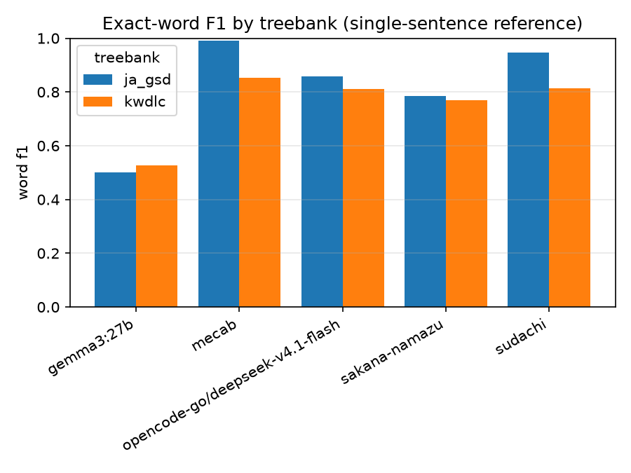
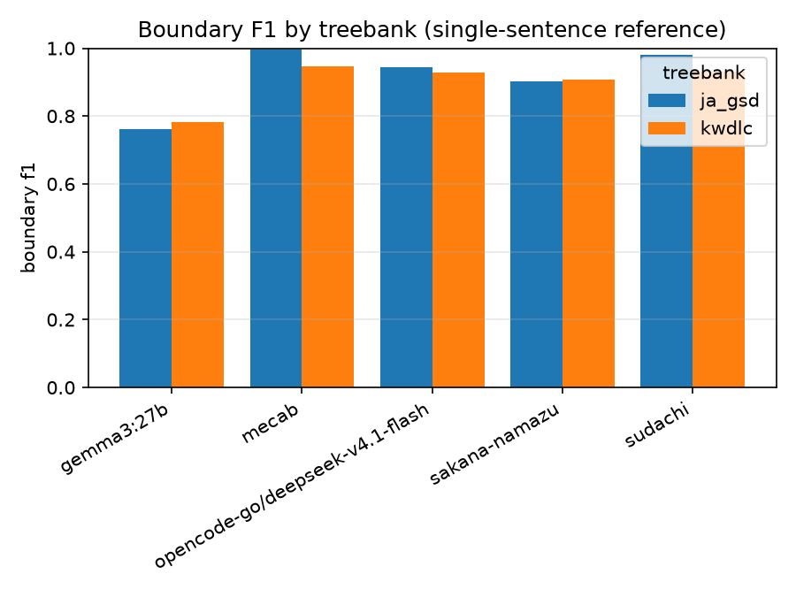
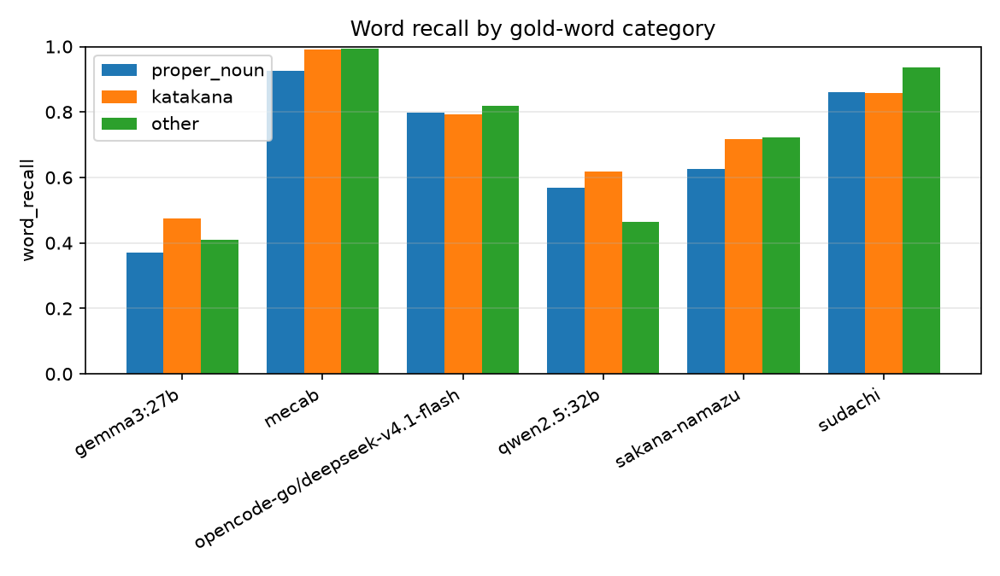
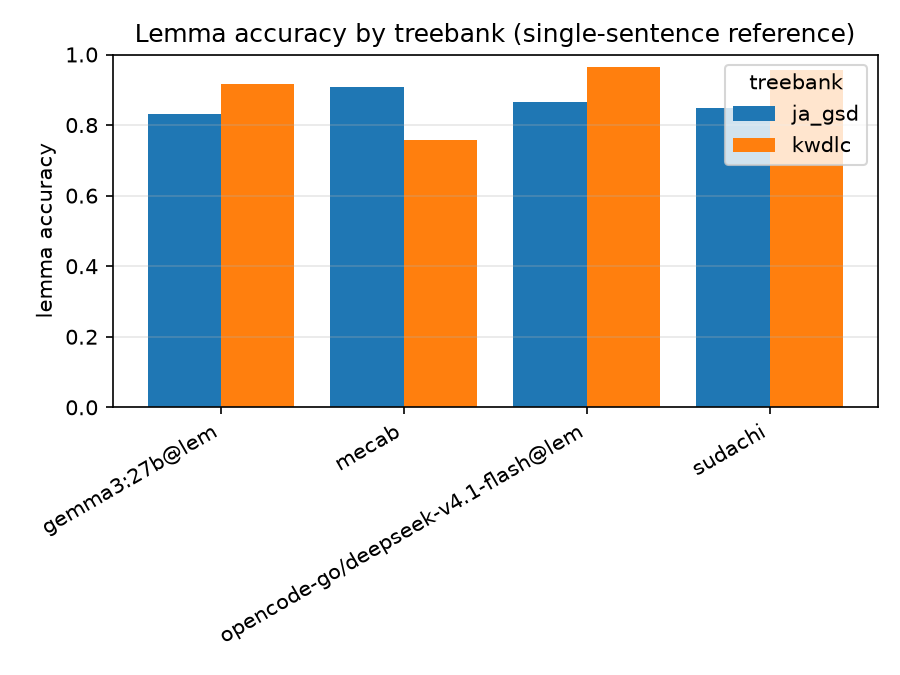
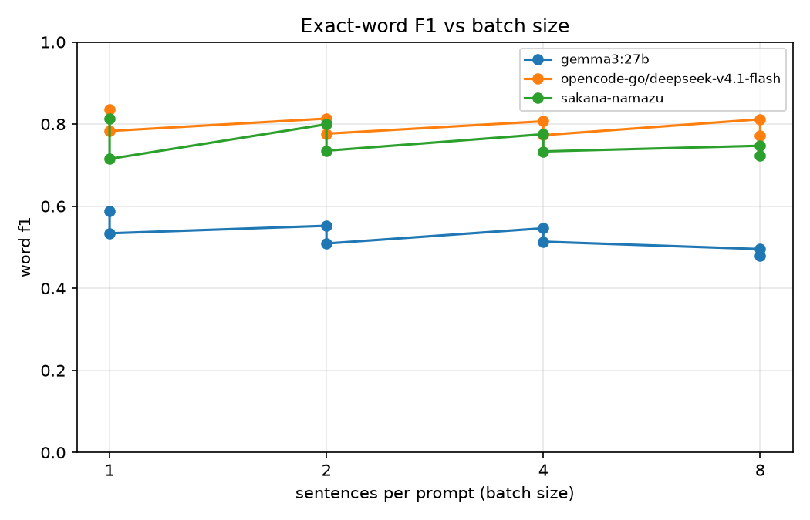

# llm-tok-eval

Evaluate prompt-based LLM Japanese word segmentation against **MeCab** and
human-annotated gold.

Japanese is written without spaces, so "word segmentation" is a real task, and
there is **no single correct segmentation**. This repo therefore:

- scores against **human gold** (Universal Dependencies Japanese treebanks),
  not against MeCab itself;
- uses **MeCab (UniDic) as a baseline**, plus optional **Sudachi** to expose how
  much of any gap is segmentation-convention mismatch;
- reports both **boundary F1** (convention-robust) and **exact-word F1**
  (strict), with bootstrap confidence intervals.

## Install

```sh
python3 -m venv .venv
.venv/bin/python -m pip install -e .          # local tier (no network at runtime)
# optional:
.venv/bin/python -m pip install -e '.[gold]'      # HuggingFace UD gold
.venv/bin/python -m pip install -e '.[sudachi]'   # Sudachi baseline
```

`fugashi` + `unidic-lite` provide literal MeCab and a bundled dictionary, so no
system MeCab dictionary is required.

## Full benchmark (one shot)

Runs the complete matrix for every dataset — **tokenization, lemma, and
batching** — then scores, compares, and plots.

Prerequisites:
1. Pull the local models: `ollama pull llama3.1:8b mistral-small3.1:24b gemma3:27b qwen2.5:32b`.
2. Clone KWDLC once (see [Gold datasets](#gold-datasets)); it is required by
   `config.kwdlc.yaml`.
3. Optional remote arms: add `OPENCODE_API_KEY` (DeepSeek via OpenCode Go) and
   `SAKANA_API_KEY` (Namazu) to `.env`. Models with no key are skipped.

```sh
# everything: UD + KWDLC, then cross-treebank figures
make full
# equivalent:
./scripts/run_full_benchmark.sh
```

What each dataset pass runs (per model in the matrix):
- baselines: `mecab` + `sudachi`
- reference: tokenization
- reference: tokenization + lemma (`--lemmas`)
- batching ablation at N ∈ {1,2,4,8}: tokenization, and tokenization + lemma
- then `score` → `compare` → `plot`

Single dataset, or re-running after an interruption (cache makes it resume):

```sh
make ud        # UD Japanese (ja_gsd) only
make kwdlc     # KWDLC only
make cross     # refresh cross-treebank figures
```

Overrides (env vars) — useful for a smoke test or a subset:

```sh
# 20 sentences, only batch N=1,2, one model:
LIMIT=20 BATCHES="1 2" MODELS=mistral-small3.1:24b \
  ./scripts/run_full_eval.sh config.yaml

MODELS="gemma3:27b,qwen2.5:32b"  # comma list; remote names welcome (skipped without keys)
ANALYZERS="mecab"                # drop Sudachi
BATCHES="1 2 4 8 16"             # widen the sweep
```

Outputs (all derived, safe to regenerate):
- `results/predictions/<treebank>/<model>[@bN][@lem].jsonl` — per-sentence spans (+ lemmas)
- `results/raw/<treebank>/<model>[@bN][@lem].jsonl` — cached completions + timings
- `results/scores/scores.jsonl` — merged across treebanks (primary artifact)
- `results/comparisons/<treebank>/comparisons.jsonl` — paired deltas + McNemar
- `results/figures/*.svg,*.png` — includes `main_*` (clean single-sentence summaries), `batch_*`, `position_*`, and (cross run) `cross_*`

Notes:
- Local models are GPU-serialized (one resident at a time); expect a long run.
  Everything is cached, so re-running `make full` only fills gaps.
- Remote models run only when named **and** their key is present.
- `make` wraps `scripts/run_full_eval.sh`; both are equivalent.

## Quick start (offline smoke test)

Runs the whole pipeline on a tiny bundled fixture, no network, no API keys:

```sh
.venv/bin/tok-eval --config config.sample.yaml all --skip-llm
# results/figures/{word_f1,boundary_f1,word_recall_by_category}.{svg,png}
```

To also exercise the **LLM path for free**, start the mock OpenAI-compatible
server (it runs MeCab under the hood, so it should match the baseline):

```sh
.venv/bin/python tests/mock_openai.py &
.venv/bin/tok-eval --config config.mock.yaml all
kill %1
```

## Real run

1. Point `config.yaml` at a treebank (default
   `universal-dependencies/universal_dependencies` / `ja_gsd`). The default
   `dataset.revision` pins a Hub commit for reproducibility. For full
   independence from the Hub, use `source: conllu` with a pinned local CoNLL-U
   file.
   Note: `datasets>=4` loads Hub datasets in Parquet form and no longer supports
   dataset loading scripts, so a namespaced id (e.g. `org/name`) is required.

### Gold datasets

- **UD Japanese (`ja_gsd`, default)** — UniDic-based, so MeCab+UniDic matches it
  almost by construction (~0.99 word F1). Good for capability-vs-convention
  deltas (boundary F1) but not a *fair* judge of MeCab.
- **KWDLC (`config.kwdlc.yaml`)** — Kyoto University Web Document Leads Corpus,
  annotated to the **JUMAN/KNP** standard (manually corrected) over **web text**.
  MeCab+UniDic gets neither the convention nor the domain for free, so this is
  the fairness check:
  ```sh
  git clone https://github.com/ku-nlp/KWDLC data/gold/kwdlc/raw
  git -C data/gold/kwdlc/raw checkout c6ae49d29eca4e1134c6676d682adf5ed6a25f5a
  .venv/bin/tok-eval --config config.kwdlc.yaml prepare
  .venv/bin/tok-eval --config config.kwdlc.yaml baseline --analyzers mecab
  .venv/bin/tok-eval --config config.kwdlc.yaml score
  .venv/bin/tok-eval --config config.kwdlc.yaml plot --all-treebanks
  ```
  Uses `id/split_for_pas/test.id` (700 docs, ~2,100 sentences). **KWDLC has no
  declared license** (research use); it is not committed and should not be
  redistributed. Scores merge across treebanks, so UD and KWDLC coexist in one
  `scores.jsonl`; `plot --all-treebanks` emits `cross_*_f1` figures.
- `source: conllu` accepts a local CoNLL-U file/dir for fully offline, pinned gold.

```sh
.venv/bin/tok-eval prepare                 # data/gold/ja_gsd/gold.jsonl
.venv/bin/tok-eval baseline --analyzers mecab,sudachi
.venv/bin/tok-eval llm --models llama3.1:8b,mistral-small3.1:24b,gemma3:27b,qwen2.5:32b
.venv/bin/tok-eval score
.venv/bin/tok-eval plot
```

The default local models are **non-reasoning, one per family**
(`llama3.1:8b`, `mistral-small3.1:24b`, `gemma3:27b`, `qwen2.5:32b`). Reasoning
models (`gpt-oss`, `qwen3`, `deepseek-r1`) are excluded: they spend most of
their output on hidden reasoning tokens and run roughly an order of magnitude
slower, with no segmentation benefit.

Add `--lemmas` to `llm` (or `all`) to also measure lemmatization:

```sh
.venv/bin/tok-eval llm --models gemma3:27b --lemmas
```

Lemmatization is a **separate arm**, not always-on. It uses a different prompt
and writes to a distinct analyzer id with an `@lem` suffix (`gemma3:27b@lem`),
so lemma runs never overwrite the plain segmentation predictions (raw/prediction
files are per analyzer). This also works with batching: `--batch-size 2 --lemmas`
→ `gemma3:27b@b2@lem`. Token-only and lemma arms sit side-by-side in
`scores.jsonl` (distinguished by the `lemma_mode` column).

`llm` talks to any **OpenAI-compatible** endpoint (`base_url` + api key).
Defaults use local Ollama (`http://localhost:11434/v1`).

### Run one model at a time

Models are always called **sequentially** (only one is loaded in Ollama at a
time) and predictions are persisted per model, so you can spread a benchmark
across sessions. Run `prepare` and `baseline` once, then one model per command:

```sh
.venv/bin/tok-eval prepare
.venv/bin/tok-eval baseline --analyzers mecab
.venv/bin/tok-eval llm --models llama3.1:8b
.venv/bin/tok-eval llm --models gemma3:27b
.venv/bin/tok-eval score && .venv/bin/tok-eval plot
```

Each `llm` run only touches that model's predictions and raw cache, so later
models do not affect earlier ones. If an endpoint is unreachable, the run warns
and **keeps any existing predictions file** rather than overwriting it with an
empty one. Local models are called sequentially (only one fits in GPU memory at
a time); to limit RAM pressure keep `OLLAMA_MAX_LOADED_MODELS=1` (the default).
Per-model `num_ctx` caps the context for large models (e.g. `qwen2.5:32b`) so
they fit in VRAM.

### Remote models

Copy `.env.example` to `.env` and fill in only what you need. Remote models are
**opt-in**: they ship `enabled: false` and run only when named with `--models`,
and they are **skipped with a warning** when the key is missing, so the local
pipeline stays runnable for free.

- `opencode-go/deepseek-v4.1-flash` — served via **OpenCode Go**
  (`https://opencode.ai/zen/go/v1`) using `OPENCODE_API_KEY`, the same key as
  OpenCode Zen (from the [OpenCode Console](https://opencode.ai/auth)). Here
  `name` is the display/`--models` label while `model: deepseek-v4.1-flash` is
  the id sent to the API; the recommended `User-Agent` and
  `x-opencode-session` headers are set via `extra_headers`. Thinking is disabled
  with `reasoning_effort: none`. Run explicitly:
  `.venv/bin/tok-eval llm --models opencode-go/deepseek-v4.1-flash`
- `sakana-namazu` via `SAKANA_API_KEY` — reasoning disabled with
  `extra_body: {chat_template_kwargs: {thinking: false}}`; tools are not passed,
  so its built-in `web_search`/`code_interpreter` never run. Run explicitly:
  `.venv/bin/tok-eval llm --models sakana-namazu`

Both require a key and are region-gated for Namazu (unavailable EU/EEA/UK/CH).

## Results and discussion

A current snapshot, **not yet the full matrix**. Complete: single-sentence
reference arms on both datasets, baselines, plus the UD-Japanese (`ja_gsd`)
batch ablation. Intentionally **not** run for now: `llama3.1:8b` and
`mistral-small3.1:24b` (local), KWDLC `qwen2.5:32b` and `sakana-namazu@lem`,
and the KWDLC batch sweep (so KWDLC has no paired `compare` rows). Everything
below is derived from `results/scores/scores.jsonl` and regenerates with:

```sh
.venv/bin/tok-eval --config config.yaml plot --all-treebanks
```

### Segmentation accuracy





| analyzer | ja_gsd word F1 | ja_gsd bnd F1 | KWDLC word F1 | KWDLC bnd F1 |
|---|---|---|---|---|
| MeCab + UniDic (baseline) | **0.991** | **0.997** | 0.852 | 0.945 |
| Sudachi (baseline) | 0.946 | 0.980 | 0.815 | 0.931 |
| deepseek-v4.1-flash (remote) | 0.858 | 0.944 | **0.811** | **0.929** |
| sakana-namazu (remote) | 0.784 | 0.902 | 0.770 | 0.907 |
| qwen2.5:32b (local) | 0.562 | 0.793 | — | — |
| gemma3:27b (local) | 0.501 | 0.762 | 0.528 | 0.781 |

- **UD-Japanese flatters MeCab+UniDic.** The baseline is near-perfect on
  `ja_gsd` (0.99 word / 1.00 boundary F1) but loses ~14 points of exact-word F1
  on KWDLC. Boundary F1 barely moves (0.997 → 0.945), so most of that gap is the
  JUMAN/KNP convention and web-domain vocabulary, not segmentation capability.
- **Sudachi is the convention-robust baseline.** It gives up ~4.5 points on UD
  versus MeCab but drops far less across treebanks (0.946 → 0.815).
- **Prompt-only LLMs are competent but below dedicated analyzers.** The best
  remote model (deepseek) reaches 0.86 / 0.81 exact-word F1 and 0.94 / 0.93
  boundary F1 — ~14 word-F1 points behind MeCab on UD and ~4 on KWDLC. Namazu
  is a close second on both.
- **Local 27B/32B models lag badly** (0.50–0.56 word F1). They emit the right
  *format* (`parse_rate` 0.92–0.96) but choose different boundaries, i.e. this
  is a genuine capability gap rather than a parsing artifact.

### Error analysis: proper nouns and format



*(UD Japanese, single-sentence tokenization arms.)*

- **Errors concentrate in proper nouns.** deepseek recalls 0.80 of UD proper
  nouns vs 0.82 overall; namazu 0.63; gemma only 0.37. Katakana and "other"
  words are much easier. Unknown-name and compound segmentation is the main
  weakness.
- **Formatting is a separate failure axis.** `parse_rate` is poor for gemma's
  lemma arm (0.63 UD / 0.67 KWDLC): it drops or folds away sentence-final
  punctuation. The parser was hardened during this work to accept
  newline-delimited output and recover trailing punctuation — namazu's UD lemma
  parse rate rose from 0.52 to 0.89 — but genuinely dropped tokens remain and
  score as zero, so gemma's lemma numbers are a lower bound.
- One `ja_gsd` sentence is absent for `sakana-namazu` (HTTP 451 content-policy
  block, `n=542`). Errors are excluded from the scored set rather than counted
  as misses, so that arm is evaluated on one fewer sentence.

### Lemma accuracy



- **deepseek lemmatizes best** (0.864 UD / 0.964 KWDLC), narrowly ahead of
  Sudachi (0.848 / 0.956).
- **MeCab's lemma accuracy drops sharply on KWDLC** (0.908 → 0.758): this is
  the UniDic katakana-lexeme convention versus JUMAN's surface-lemma convention
  (see [Lemmatization caveat](#lemmatization-caveat)), not a dictionary-quality
  problem.
- gemma@lem is weakest (0.831 / 0.917) and has the worst coverage because of
  its formatting drops.

### Batch ablation (UD Japanese)



- **Batching is not free.** The `@b1` control (batch prompt, one sentence) sits
  close to the single-sentence reference; going to N=2–8 costs exact-word F1
  monotonically for deepseek (0.858 → 0.812) and namazu (0.784 → 0.747). gemma
  improves slightly at `@b1` (prompt wording) then degrades.
- Per-sentence decode cost is essentially flat (deepseek ~50–52 generated
  tokens/sentence from b1 to b8), so batching does not buy throughput either; it
  mainly cuts HTTP round-trips.
- Position effects are small — deepseek boundary F1 stays 0.925–0.928 across
  positions in a batch — though gemma@lem@b8 falls from 0.636 at position 0 to
  0.533 at position 7.

### Throughput

Local generation is roughly **9–10 eval tok/s** (gemma3:27b 10.3, qwen2.5:32b
8.9 median). Baseline analyzers are CPU dictionaries and effectively instant on
these sentence lengths. The remote providers do not report decode durations, so
only wall-clock and token counts are cached for them.

### Limitations

- Partial model matrix (see snapshot above); KWDLC in particular has no local
  LLM arms and no batch sweep, hence no paired comparisons there.
- Single seed, `temperature=0`; bootstrap intervals reflect sentence
  resampling only, not model stochasticity.
- Cross-treebank deltas mix capability, domain, and annotation convention.
- Baselines are dictionaries with their own conventions, not ground truth; the
  "gap" to a human gold standard is not directly observable.
- KWDLC has no declared license (research use only; not redistributed).

## Reproducibility

- `temperature=0`, `top_p=1`, pinned toolchain and dependencies.
- Every raw completion is cached to `results/raw/<treebank>/<analyzer>.jsonl`
  keyed by a hash of (analyzer, base_url, prompt, temperature, request variant,
  text). Re-runs never re-query; `--offline` scores purely from cache even if a
  remote alias changes underneath.
- Every score record carries `model_version`, `prompt_sha256`, `config_hash`,
  `seed`, `tier`, `n`, `ci_low`, `ci_high`.

## Outputs

```
data/gold/<treebank>/gold.jsonl          # id, text, spans, words, upos
results/raw/<treebank>/<analyzer>.jsonl  # cached completions + timings
results/predictions/<treebank>/*.jsonl   # per-sentence predicted spans (+ lemmas)
results/scores/scores.jsonl              # PRIMARY (tidy, one row per metric)
results/scores/scores.csv                # derived
results/scores/scores.parquet            # derived
results/figures/*.svg, *.png             # derived
```

`scores.jsonl` is the canonical artifact; CSV/Parquet and figures are generated
from it.

## Metrics

- `boundary_{precision,recall,f1}` — character word-start boundaries.
- `word_{precision,recall,f1}` — exact word-span matches.
- `word_recall` broken down by `category`: `proper_noun`, `katakana`, `other`.
- `parse_rate` — fraction of LLM outputs that reconstructed the input exactly.
- `lemma_accuracy` / `lemma_coverage` — exact lemma match, and the share of gold
  tokens the analyzer aligned and lemmatized (when lemmas are predicted).
- `eval_tokens_per_s` / `prompt_tokens_per_s` — decode and prefill throughput
  (median with p10–p90), from Ollama's native timings.
- `empty_content_rate` — share of calls that returned no answer content.

### Throughput and reasoning models

`api: ollama` uses Ollama's native `/api/chat`, so each raw record stores exact
timings (`eval_count`, `eval_duration`, `prompt_eval_count`,
`prompt_eval_duration`, `total_duration`). `api: openai` (default) stores
wall-clock and token usage where the provider reports it.

Reasoning models spend most of their output on an internal chain of thought
rather than the short segmentation, so they are much slower with no accuracy
benefit for this task. That is why the local matrix is non-reasoning only. If
you add a reasoning model:

- Control effort with `reasoning_effort` (per model or `--reasoning-effort`); on
  Ollama, `none` maps to `think: false`.
- Some providers need a provider-specific switch, passed via `extra_body` (for
  example Sakana Namazu: `{chat_template_kwargs: {thinking: false}}`).
- Empty or truncated responses are counted in `empty_content_rate` and are
  re-queried on the next online run rather than reused.

### Lemmatization caveat

UD Japanese gold's `LEMMA` is UniDic-derived but overrides it for some classes:
UniDic's `lemma` is the katakana lexeme for proper nouns/numerals
(東京 → `トウキョウ`), whereas UD uses the surface. Measured against UD GSD,
MeCab/UniDic `lemma` matches gold ~91% token-aligned (98%+ for verbs/adjectives/
auxiliaries, but low for PROPN/NUM). `lemma_accuracy` is therefore a *native
convention* comparison; read it alongside the PROPN/NUM breakdown rather than as
pure error.

## Layout

```
src/tok_eval/
  cli.py      # tok-eval subcommands
  config.py   # config + env resolution
  gold.py     # CoNLL-U / KNP (KWDLC) / HuggingFace -> gold.jsonl
  mecab.py    # MeCab (literal) + optional Sudachi
  llm.py      # OpenAI-compatible calls + caching + parsing
  score.py    # boundary/word F1 + bootstrap CIs
  compare.py  # paired variant comparison (bootstrap + McNemar)
  plot.py     # matplotlib/seaborn figures
  text.py     # span utilities
scripts/
  run_full_eval.sh       # full token+lemma+batching pass for one dataset
  run_full_benchmark.sh  # every dataset + cross-treebank figures
Makefile     # make full | ud | kwdlc | cross
tests/        # unit tests + CoNLL-U / KWDLC fixtures
```

Run tests: `.venv/bin/python -m pytest -q`

## Batch ablation

By default the benchmark prompts **one sentence per call** (the reference). To
measure whether batching many sentences changes accuracy, pass `--batch-size N`:

```sh
# reference (single-sentence prompt)
.venv/bin/tok-eval llm --models gemma3:27b

# batch template at N=1,2,4,8
.venv/bin/tok-eval llm --models gemma3:27b --batch-size 1
.venv/bin/tok-eval llm --models gemma3:27b --batch-size 8

.venv/bin/tok-eval score && .venv/bin/tok-eval plot && .venv/bin/tok-eval compare
```

- Batch runs use a separate prompt (`prompts/segment_ja_batch.txt`) and a
  distinct analyzer id `<model>@b<N>`, so they never overwrite the reference
  predictions. The `@b1` arm is the control that isolates batching from prompt
  wording.
- The output cap scales with `N` so truncation can't be mistaken for a batching
  effect.
- `score` adds a `batch_size` column, `batch_parse_rate`, per-position F1
  (`category=posK`), and per-sentence-normalized throughput
  (`tokens_per_sentence`, `wall_s_per_sentence`).
- `compare` writes paired per-sentence deltas (bootstrap CI) and a McNemar test
  to `results/comparisons/`, comparing each arm against `@b1` and the reference.
- Figures: `batch_*_f1`, `batch_tokens_per_sentence`, `position_boundary_f1`.

Grouping is consecutive in gold order (deterministic); position effects are
reported rather than averaged away.

## License

Code is released under the **BSD Zero Clause License (0BSD)** (see `LICENSE`).
Dependency and MeCab/UniDic license texts are listed in `THIRD_PARTY_NOTICES.md`;
MeCab and UniDic are used under their permissive BSD option, so there are no
copyleft obligations.

The benchmark **gold data is not 0BSD-licensed** and is not committed here: it is
derived from Universal Dependencies treebanks under Creative Commons terms
(e.g. UD_Japanese-GSD is CC BY-SA 4.0; UD_Japanese-BCCWJ is CC BY-NC-SA 4.0).
Check the license of the specific pinned treebank before redistributing.

